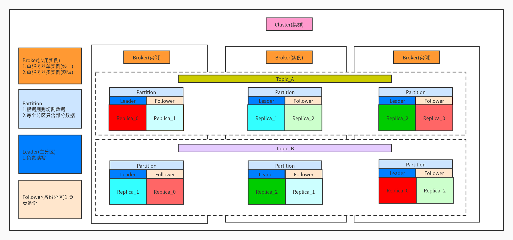
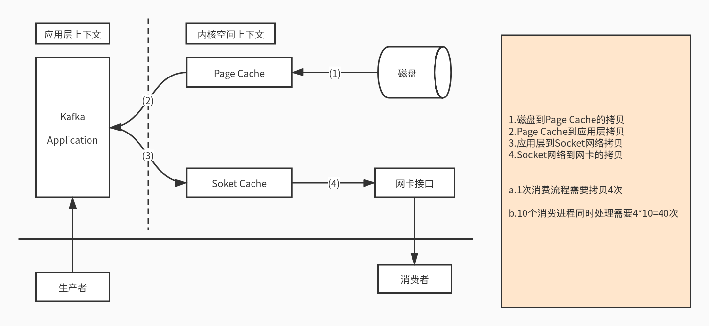
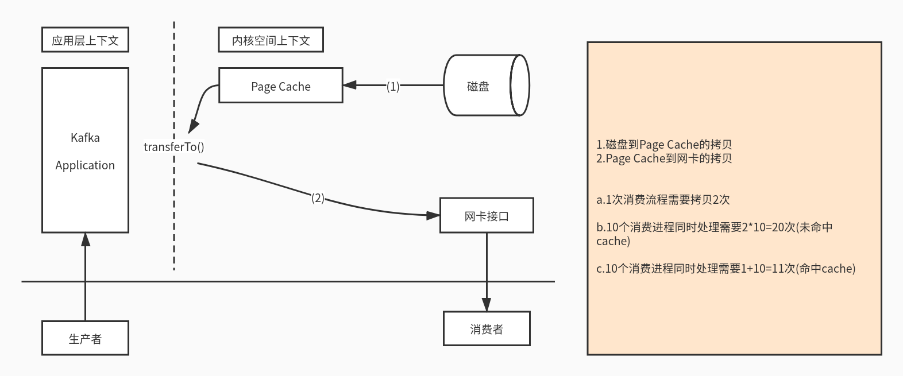

# Kafka

1. 安装包：[kafka\_2.11-0.10.2.0.tgz](https://pan.baidu.com/s/16tPj6sB0uG8zoJKN4DR-bQ) 提取码: 4xnq
2. 官方下载：[http://kafka.apache.org/downloads](http://kafka.apache.org/downloads)

## 重点

### 1. 高吞吐,单节点吞吐量为什么比别的队列大?

* 零拷贝

* 顺序写入
* 预读

  不是单独读取一条数据，一般是把关联或相近的数据一块读取，下次查询就会快很多\(应用缓存/pagecache缓存\)

* 后写

  不是单独写入一条数据，一般是放入磁盘缓存中

  当磁盘缓存达到某个阈值后，然后由操作系统一次写入很多的数据，效率很快，

  而且磁盘缓存访问速度也比较快，比访问文件快很多

* 分段日志
* 批处理

  每个分区对应一个双端队列，每次处理一批而不是一个一个处理

* 压缩

  将数据转化为byte数组进行压缩，数据压缩变小后传输更快，获取的时候需要解压\(序列化于反序列化\)，默认的是none需要主动配置

### 2. offset存放位置及为什么?

* Zookeeper
* Kafka Cluster

  频繁消费会导致频繁更新Zookeeper，导致增加Zookeeper负载，0.9版本后保存至集群

* 自定义\(Redis/Mysql/etc\)

  offset自动提交可能会引起数据重复消费，所以服务端自己控制offset提交\(支持同步/异步提交\)

### 3.Kafka消费方式

* poll拉取方式，可以控制消费速率

### 4.数据丢失和重复消费问题

* 生产者：同步发送数据，应用层异步发送，当集群连接错误或处理失败等情况导致发送丢失
* 生产者：ack应答机制
* 消费者：再平衡时可能导致offset发生改变导致获取不到数据，这个没有什么好的解决办法
* 自己维护offset避免重复消费\(需要使用低级API实现，因为更细力度控制，所以实现更复杂\)

### 5.Kafka元数据存储在哪

* Zookeeper\(/controller，/cluster，/consumer，/broker，etc\)

### 6.发布订阅如果保证不同的组消费到相同的内容

* HW（High Watermark）
* LEO（Log End Offset）
* leader待所有follower同步后更新HW,所有follower最小的HW就是leader的HW,LEO和HW之间的数据不可见

### 7.leader选举机制

* Zookeeper：投票选举机制
* Broker：创建/controller\(集群控制器，临时节点\)机制，最先创建节点者成为leader，其它几点注册watch，leader宕掉以后其它Broker继续创建，最先创建节点者成为leader
* ISR：副本选取机制，当副本全部挂掉后自动等待，如果不是ISR的副本恢复也会选举成leader，当然这样的副本数据可能落后不全导致其它问题

### 8.消费速度

* 增加分区和消费者
* 增加拉取数据大小
* 增加批处理大小

### 9.分区

* Leader
* Follower
* Replication
* 分区问题

  a.分区算法

  b.顺序消费，只设置一个分区或增加key根据算法将同一类key放入同一分区

### 10.ISR中的BrokerId什么时候会消失

* Broker宕掉
* 网络问题导致
* Lag落后，Follower拉取时间超过阈值没有更新，Follower数据条数超过指定阈值条数\(0.9版本移除该配置\)

