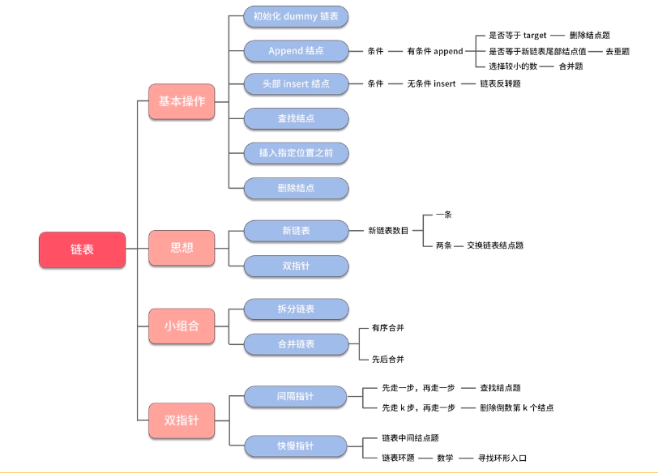

# 链表
## 特点
- 初始化
- 追加节点
- 头部插入节点
- 查找节点
- 插入指定位置之前
- 删除节点

******

******

******
```java
public class MyLinkedList {

    ListNode dummy = new ListNode();
    ListNode tail = dummy;
    int length = 0;

    static class ListNode {
        // 节点元素
        public int val = 0;
        // 下一个节点
        public ListNode next = null;

        public ListNode() {
        }

        public ListNode(int val) {
            this.val = val;
        }
    }

    // 初始化列表
    public MyLinkedList() {

    }

    // 尾部插入
    public void addAtTail(int val) {
        tail.next = new ListNode(val);
        tail = tail.next;
        length++;
    }

    // 头部插入
    public void addAtHead(int val) {
        ListNode node = new ListNode(val);
        node.next = dummy.next;
        dummy.next = node;

        if (tail == dummy) {
            tail = node;
        }
        length++;
    }

    // 获取链表第index个节点值
    public int get(int index) {
        if (index < 0 || index >= length) {
            return -1;
        }
        return getPrevNode(index).next.val;
    }

    // 在链表第index位置插入节点
    public void addAtIndex(int index, int val) {
        if (index > length) {
            return;
        } else if (index == length) {
            addAtTail(val);
        } else if (index <= 0) {
            addAtHead(val);
        } else {
            ListNode prev = getPrevNode(index);
            ListNode node = new ListNode(val);
            node.next = prev.next;
            prev.next = node;
            length++;
        }

    }

    // 如果index有效，删除第index节点
    public void deleteAtIndex(int index) {
        if (index < 0 || index >= length) {
            return;
        }

        ListNode prev = getPrevNode(index);

        if (tail == prev.next) {
            tail = prev;
        }

        prev.next = prev.next.next;
        length--;
    }

    // 获取前一个节点
    private ListNode getPrevNode(int index) {
        ListNode front = dummy.next;
        ListNode back = dummy;

        for (int i = 0; i < index && front != null; i++) {
            back = front;
            front = front.next;
        }

        return back;
    }

    public static void main(String[] args) {
        MyLinkedList linkedList = new MyLinkedList();

        linkedList.addAtHead(100);
        linkedList.addAtHead(200);
        linkedList.addAtHead(300);

        int val = linkedList.get(1);
        System.out.println(val);

        linkedList.addAtIndex(1, 600);

        val = linkedList.get(2);
        System.out.println(val);
    }

}
```
******