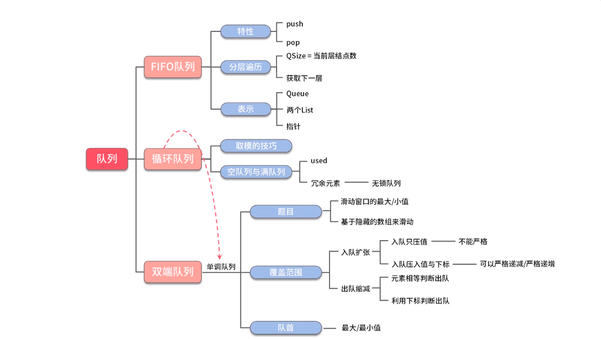

# 队列
## 特点
1.先进先出(FIFO:First In First Out)
2.单调队列

******

******
## 索引技巧
```java
public abstract class IndexMock {

    /**
     * 循环队列下一个索引算法技巧
     *
     * @param i        当前索引
     * @param capacity 数组容量
     * @return 下一个索引
     */
    public static int beforeMockMod(int i, int capacity) {
        return (i + 1) % capacity;
    }

    /**
     * 循环队列上一个索引算法技巧
     *
     * @param i        当前索引
     * @param capacity 数组容量
     * @return 上一个索引
     */
    public static int afterMockMod(int i, int capacity) {
        return (i - 1 + capacity) % capacity;
    }

    public static void main(String[] args) {
        int beforeMod = beforeMockMod(0, 5);
        int afterMod = afterMockMod(0, 5);
        System.out.println(beforeMod + "," + afterMod);
    }

}
```
******
## 循环队列
- used变量控制
```java
public class CircularQueueUsed {

    private int used = 0;

    // 第一个元素所在位置
    private int first = 0;

    // 元素入队的索引位置
    private int index = 0;

    private int capacity = 0;

    private int[] elements = null;

    public CircularQueueUsed(int k) {
        this.capacity = k;
        elements = new int[k];
    }

    public boolean enQueue(int val) {
        if (isFull()) {
            return false;
        }

        elements[index] = val;

        index = (index + 1) % capacity;

        used++;

        return true;
    }

    public boolean deQueue() {
        if (isEmpty()) {
            return false;
        }

        elements[first] = -1;

        first = (first + 1) % capacity;

        used--;

        return true;
    }

    public int first() {
        if (isEmpty()) {
            return -1;
        }

        return elements[first];
    }

    public int last() {
        if (isEmpty()) {
            return -1;
        }

        int tail = (index - 1 + capacity) % capacity;

        return elements[tail];
    }

    public boolean isFull() {
        return used == capacity;
    }

    public boolean isEmpty() {
        return used == 0;
    }

    @Override
    public String toString() {
        return "CircularQueueUsed{" +
                "elements=" + Arrays.toString(elements) +
                '}';
    }

    public static void main(String[] args) {
        CircularQueueUsed queue = new CircularQueueUsed(5);

        queue.enQueue(1);
        queue.enQueue(2);
        queue.enQueue(3);
        queue.enQueue(4);
        queue.enQueue(5);
        queue.enQueue(6);

        queue.deQueue();

        int first = queue.first();
        System.out.println(first);
        int last = queue.last();
        System.out.println(last);
        System.out.println(queue);
    }
}
```
- 空间变量控制
```java
public class CircularQueueSpace {

    // 队列头部元素索引
    private int first = 0;

    // 队列尾部元素索引
    private int index = 0;

    private int[] elements = null;

    private int capacity = 0;

    public CircularQueueSpace(int k) {
        capacity = k + 1;
        elements = new int[k + 1];
    }

    public boolean enQueue(int val) {
        if (isFull()) {
            return false;
        }

        elements[index] = val;
        index = (index + 1) % capacity;

        return true;
    }

    public boolean deQueue() {
        if (isEmpty()) {
            return false;
        }

        elements[first] = -1;
        first = (first + 1) % capacity;
        return true;
    }

    public int first() {
        return isEmpty() ? -1 : elements[first];
    }

    public int last() {
        int tail = (index - 1 + capacity) % capacity;
        return isEmpty() ? -1 : elements[tail];
    }

    public boolean isFull() {
        return (index + 1) % capacity == first;
    }

    public boolean isEmpty() {
        return first == index;
    }

    @Override
    public String toString() {
        return "CircularQueueSpace{" +
                "elements=" + Arrays.toString(elements) +
                '}';
    }

    public static void main(String[] args) {
        CircularQueueSpace queue = new CircularQueueSpace(5);

        queue.enQueue(1);
        queue.enQueue(2);
        queue.enQueue(3);
        queue.enQueue(4);
        queue.enQueue(5);
        queue.enQueue(6);
        queue.enQueue(7);

        queue.deQueue();

        queue.enQueue(10);

        System.out.println(queue.toString());
    }
}
```
******
## 单调队列
### 单调递减队列
```java
public class MonotoneDecreasingQueue {

    private ArrayDeque<Integer> queue = new ArrayDeque<>();

    public void push(int val) {
        while (!queue.isEmpty() && queue.getLast() < val) {
            queue.removeLast();
        }
        queue.addLast(val);
    }

    public void pop(int val) {
        if (!queue.isEmpty() && queue.getFirst() == val) {
            queue.removeFirst();
        }
    }

}
```
- 滑动窗口
```java
public class SlideWindow {
    public int[] maxSlideWindow(int[] nums, int k) {
        List<Integer> results = new ArrayList<>();

        for (int i = 0; i < nums.length; i++) {
            push(nums[i]);
            if (i < (k - 1)) {
                continue;
            }
            results.add(queue.getFirst());
            pop(nums[i - k + 1]);
        }
        return results.stream().mapToInt(Integer::valueOf).toArray();
    }
    public static void main(String[] args) {
        int[] array = new int[]{1, 0, -99, -1000, 1, 4};
        MonotoneDecreasingQueue queue = new MonotoneDecreasingQueue();
        int[] maxs = queue.maxSlideWindow(array, 3);
        System.out.println(Arrays.toString(maxs));
    }
}
```
- 捡金币
```java
public class PickGold {
    public int maxResult(int[] array, int k) {
        if (array == null || array.length == 0 || k <= 0) {
            return 0;
        }

        final int length = array.length;
        int[] tmps = new int[length];

        MonotoneDecreasingQueue queue = new MonotoneDecreasingQueue();

        for (int i = 0; i < length; i++) {
            if (i - k > 0) {
                queue.pop(tmps[i - k - 1]);
            }

            int old = queue.queue.isEmpty() ? 0 : queue.queue.getFirst();
            tmps[i] = old + array[i];

            queue.push(tmps[i]);
        }

        return tmps[length - 1];
    }
    public static void main(String[] args) {
        int[] moneys = new int[]{1, -1, -100, -1000, 100, 3};
        int max = queue.maxResult(moneys, 2);
        System.out.println(max);
    }
}
```
******
### 严格单调递减队列
```java
public class MonotoneDecreasingStrictQueue {

    class Node {
        // 累计获取的金币
        int sum = 0;
        // 在index=idx的时候，取得的最大金币为sum
        int idx = 0;

        public Node(int sum, int idx) {
            this.sum = sum;
            this.idx = idx;
        }
    }

    // 捡金币算法
    public int maxResult(int[] array, int k) {
        // 严格单调递减队列
        // 记录了每个位置可以收集到的金币及下标
        ArrayDeque<Node> queue = new ArrayDeque<>();

        // 走到i位置时,最大的金币收益
        int ans = 0;

        for (int i = 0; i < array.length; i++) {

            // 出队
            // 对于i而言
            // [i-k, i-1]可以跳到array[i]
            // 最远i-(i-k)=k
            // 超出这个范围的出队
            while (!queue.isEmpty() && i - queue.getFirst().idx > k) {
                queue.removeFirst();
            }

            // 获得位置i时的收益
            if (queue.isEmpty()) {
                ans = array[i];
            } else {
                ans = queue.getFirst().sum + array[i];
            }

            // 入队,当array[i]入队的时候，把小于等于当前收益的踢掉
            // 严格单调递减
            while (!queue.isEmpty() && queue.getLast().sum <= ans) {
                queue.removeLast();
            }

            // 入队
            queue.addLast(new Node(ans, i));
        }
        return ans;
    }

    public static void main(String[] args) {
        int[] moneys = new int[]{1, -1, -100, -1000, 100, 3};
        MonotoneDecreasingStrictQueue queue = new MonotoneDecreasingStrictQueue();
        int max = queue.maxResult(moneys, 2);
        System.out.println(max);
    }

}
```