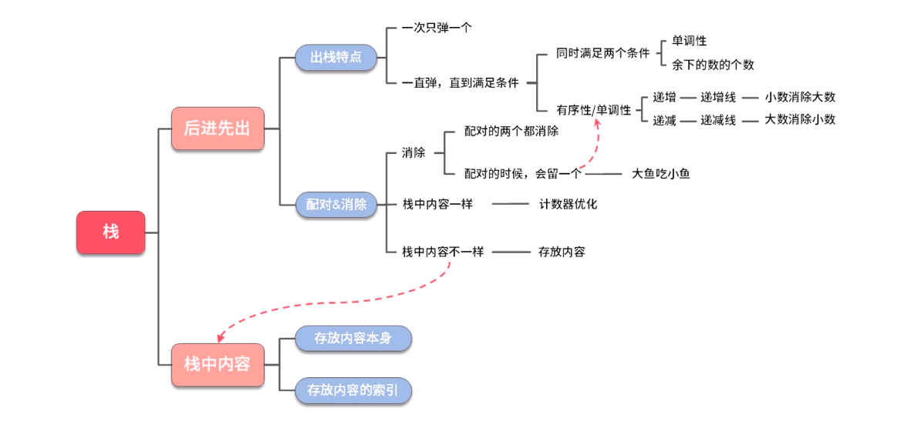

# 栈
## 特点
1.后进先出

******

******

## 深度
1.配对/消除
### 优化
1.内容一样时,计数器优化

```java
class StackMock {
    // 括号匹配算法
    boolean isValid(String text) {
        // 内容为空返回true
        if (s == null || s.length() == 0) {
            return true;
        }
        // 字符串长度为奇数返回false
        if (s.length() % 2 == 1) {
            return false;
        }
        // ******1.消除法使用核心数据结构(压栈出栈消除)******
        Stack<Character> stack = new Stack();
        // ******2.消除法使用核心数据结构(优化为计数器)******
        int count = 0;
        for (int i = 0; i < text.length(); i++) {
            char c = text.charAt(i);
            if (c == '(') {
                // 1.压栈
                stack.push(c);
                // 2.计数
                count++;
            } else if (c == ')') {
                // 1.栈空时不匹配导致出栈失败,返回false
                if (stack.empty()) {
                    return false;
                }
                // 2.计数器无法消除,返回false
                if (count <= 0) {
                    return false;
                }
                // 1.出栈
                t.pop();
                // 2.计数器消除
                --count;
            }
        }
        // 栈空时括号匹配
        return stack.empty();
    }
}
```
## 广度

```java
class StackMock {
    // 大鱼吃小鱼算法
    // fishSize: 鱼大小, fishDirection: 鱼方向, left: 0, rigth: 1,同时游动且每次一个单位
    int solution(int[] fishSize, int[] fishDirection) {
        final int fishCount = fishSize.length;
        // 小于等于一条鱼时返回
        if (fishCount <= 1) {
            return fishCount;
        }
        final int left = 0;
        final int right = 1;
        Stack<Integer> stack = new Stack();
        for (int i = 0; i < fishCount; i ++) {
            final int currentSize = fishSize[i];
            final int currentDirection = fishDirection[i];
            
            // 当前鱼是否被吃掉
            boolean hasEat = false;
            
            // 栈中不为空,且栈顶鱼向右,当前鱼向左时进行消除逻辑
            while (!stack.empty() && fishDirection[stack.peek()] == rigth && currentDirection == left) {
                // 栈顶鱼大于当前鱼,当前鱼被吃掉
                if (fishSize[stack.peek()] > currentSize) {
                    hasEat = true;
                    break;
                }
                // 栈顶鱼小于当前鱼,栈顶鱼被吃掉,出栈,循环继续
                stack.pop();
            }
            
            // 当前鱼未被吃掉入栈
            if (!hasEat) {
                stack.push(i);
            }
        }
        // 栈中所剩元素大小即是最终所剩鱼大小
        return stack.size();
    }
}
```

## 单调栈(栈中元素是按照升序或降序排列),递增栈或递减栈
```java
class StackMock {
    // 获取数组每个元素右边第一个比自己小的下标
    int[] findRightSmall(int[] A) {
        // 记录比自己小的下标
        int[] results = new int[A.length];
        // 栈中记录索引
        Stack<Integer> stack = new Stack();
        
        // 遍历元素
        for (int i = 0; i < A.length; i++) {
            // 当前元素
            final int x = A[i];
            // 栈不为空且栈顶元素大于当前元素
            while (!stack.empty() && A[stack.peek()] > x) {
                // 记录比自己小的索引
                results[stack.peek()] = i;
                // 找到比自己小的弹出
                stack.pop();
            }
            // 栈为空或栈顶元素小于当前元素,入栈构成单调递增栈
            stack.push(i);
        }
        
        // 栈中剩余元素找不到右边比自己小的记录为-1
        while (!stack.empty()) {
            results[stack.peek()] = -1;
            stack.pop();
        }
        
        // 返回
        return results;
    }
}
```
```java
class Stack{
    // 给定
    public static int[] findSmallSeq(int[] nums, int k) {
        int[] results = new int[k];
        Stack<Integer> stack = new Stack<>();

        for (int i = 0; i < nums.length; i++) {
            // 当前数
            final int x = nums[i];
            // 数据剩余个数
            final int left = nums.length - i;
            
            // 栈不等于空,且(栈中元素个数+剩余个数)大于k,且栈顶元素大于当前数时出栈
            while (!stack.empty() && ((stack.size() + left) > k) && stack.peek() > x) {
                stack.pop();
            }
            // 否则入栈
            stack.push(x);
        }
        
        // 单调递增个数大于k,将栈顶最大数出栈
        while (stack.size() > k) {
            stack.pop();
        }
        
        // 注意出栈顺序设置对应索引位置
        for (int i = k - 1; i >= 0; i--) {
            results[i] = stack.peek();
            stack.pop();
        }
        
        // 返回
        return results;
    }
}
```

## 总结
1.栈中存放内容本身
2.栈中存放内容索引
3.出栈一个元素或循环出栈到达某个条件