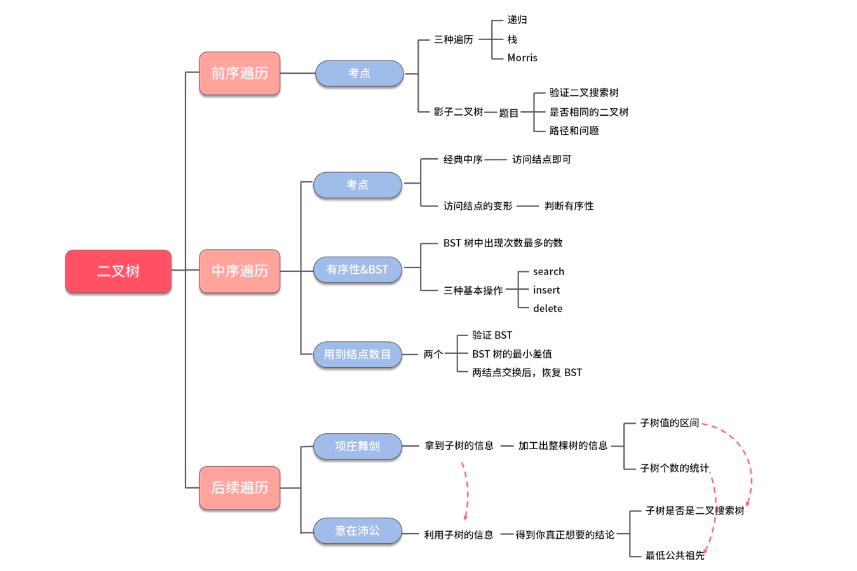

# 树
******

******
```java
public class TreeNode {

    int val = 0;
    TreeNode left = null;
    TreeNode right = null;

    public TreeNode() {
    }

    public TreeNode(int val) {
        this.val = val;
    }

    // 前序遍历
    void beforeOrder(TreeNode root, List<Integer> results) {
        if (root != null) {
            results.add(root.val);
            beforeOrder(root.left, results);
            beforeOrder(root.right, results);
        }
    }

    // 中序遍历
    void middleOrder(TreeNode root, List<Integer> results) {
        if (root != null) {
            middleOrder(root.left, results);
            results.add(root.val);
            middleOrder(root.right, results);
        }
    }

    // 后序遍历
    void afterOrder(TreeNode root, List<Integer> results) {
        if (root != null) {
            afterOrder(root.left, results);
            afterOrder(root.right, results);
            results.add(root.val);
        }
    }

    // 前序遍历,栈
    List<Integer> beforeOrderStack(TreeNode root) {
        Stack<TreeNode> stack = new Stack<>();
        List<Integer> results = new ArrayList<>();
        while (root != null || !stack.isEmpty()) {
            // 记录根节点切一直向左走
            while (root != null) {
                stack.push(root);
                results.add(root.val);
                root = root.left;
            }
            // 到达最左边,弹出节点,转向右子树
            root = stack.peek();
            stack.pop();
            root = root.right;
        }
        return results;
    }

    // 中序遍历,栈
    List<Integer> middleOrderStack(TreeNode root) {
        Stack<TreeNode> stack = new Stack<>();
        List<Integer> results = new ArrayList<>();
        while (root != null || !stack.isEmpty()) {
            // 往左走,连续入栈,直到不能走为止
            while (root != null) {
                stack.push(root);
                root = root.left;
            }
            // 到达最左边,弹出节点,进行遍历
            root = stack.peek();
            stack.pop();
            results.add(root.val);
            // 转向右子树
            root = root.right;
        }
        return results;
    }

    // 后序遍历,栈
    List<Integer> afterOrderStack(TreeNode root) {
        Stack<TreeNode> stack = new Stack<>();
        List<Integer> results = new ArrayList<>();
        TreeNode beforeNode = null;

        while (root != null || !stack.isEmpty()) {
            while (root != null) {
                stack.push(root);
                root = root.left;
            }

            root = stack.peek();
            if (root.right == null || root.right == beforeNode) {
                results.add(root.val);
                stack.pop();
                beforeNode = root;
                root = null;
            } else {
                root = root.right;
            }
        }
        return results;
    }

    private List<List<Integer>> results = new ArrayList<>();

    // 路径及目标
    public void backtrace(TreeNode root, List<Integer> path, int sum, int target) {
        if (root == null) {
            return;
        }

        sum += root.val;
        path.add(root.val);

        if (root.left == null && root.right == null) {
            if (sum == target) {
                results.add(path);
            }
        } else {
            // 回溯,分别查看子情况
            backtrace(root.left, path, sum, target);
            backtrace(root.right, path, sum, target);
        }

        // 函数结束后弹栈,也要把节点从路径最后扔掉
        path.remove(path.size() - 1);
    }

    TreeNode low = null;

    // 最低公共祖先
    private int low(TreeNode root, TreeNode p, TreeNode q) {
        if (root == null) {
            return 0;
        }
        int leftCount = low(root.left, p, q);
        int rightCount = low(root.right, p, q);

        if (leftCount == 1 && rightCount == 1) {
            low = root;
        } else if (leftCount == 1 || rightCount == 1) {
            if (root.val == p.val || root.val == q.val) {
                low = root;
            }
        }
        return leftCount + rightCount + ((root.val == p.val || root.val == q.val) ? 1 : 0);
    }

    // 验证二叉搜索树(根节点大于左节点,小于右节点)
    private boolean valid = true;

    public void valid(TreeNode root, Long l, Long r) {
        if (root == null || !valid) {
            return;
        }
        if (!(l < root.val && root.val < r)) {
            valid = false;
            return;
        }
        valid(root.left, l, (long) root.val);
        valid(root.right, (long) root.val, r);
    }

    private void swapValue(TreeNode a, TreeNode b) {
        int t = a.val;
        a.val = b.val;
        b.val = t;
    }

    public TreeNode deleteNode(TreeNode root, int key) {
        if (root == null) {
            return null;
        }
        if (key < root.val) {
            root.left = deleteNode(root.left, key);
        } else if (key > root.val) {
            root.right = deleteNode(root.right, key);
        } else {
            if (root.left == null && root.right == null) {
                // 当前树只有一个节点,直接返回null
                return null;
            } else if (root.left != null) {
                // 当前节点还有左子树
                // 需要从左子树中找个较大的值
                TreeNode large = root.left;
                while (large.right != null) {
                    large = large.right;
                }
                // 交换再删除
                swapValue(root, large);
                root.left = deleteNode(root.left, key);
            } else if (root.right != null) {
                // 当前节点还有右子树
                // 需要从右子树中找个较小的值
                TreeNode small = root.right;
                while (small.left != null) {
                    small = small.left;
                }
                // 交换再删除
                swapValue(root, small);
                root.right = deleteNode(root.right, key);
            }
        }
        return root;
    }

    /**
     * *******************************1000
     * *****************50*********************************1500
     * ************25*********80********************1400*************1800
     * ******************70*********90
     *
     * @param args
     */
    public static void main(String[] args) {
        TreeNode root = new TreeNode();
        root.val = 1000;

        TreeNode nodeLeft1 = new TreeNode();
        nodeLeft1.val = 50;

        TreeNode nodeLeft2Left = new TreeNode();
        nodeLeft2Left.val = 25;
        TreeNode nodeLeft2Right = new TreeNode();
        nodeLeft2Right.val = 80;

        TreeNode extraLeft = new TreeNode();
        extraLeft.val = 70;
        nodeLeft2Right.left = extraLeft;

        TreeNode extraRight = new TreeNode();
        extraRight.val = 90;
        nodeLeft2Right.right = extraRight;

        nodeLeft1.left = nodeLeft2Left;
        nodeLeft1.right = nodeLeft2Right;

        TreeNode nodeRight1 = new TreeNode();
        nodeRight1.val = 1500;

        TreeNode nodeRight2Left = new TreeNode();
        nodeRight2Left.val = 1400;
        TreeNode nodeRight2Right = new TreeNode();
        nodeRight2Right.val = 1800;

        nodeRight1.left = nodeRight2Left;
        nodeRight1.right = nodeRight2Right;

        root.left = nodeLeft1;
        root.right = nodeRight1;

        TreeNode tree = new TreeNode();

        // 最小公共祖先
        int low = tree.low(root, new TreeNode(90), new TreeNode(1800));
        System.out.println(low);

        // 后序遍历
        List<Integer> after = tree.afterOrderStack(root);
        System.out.println(after);

        // 删除节点
        TreeNode treeNode = tree.deleteNode(root, 80);
        System.out.println(treeNode.val);

        // 树的路径
        List<Integer> path = new ArrayList<>();
        tree.backtrace(root, path, 0, 1000);

        // 验证二叉搜索树
        tree.valid(root, Long.MIN_VALUE, Long.MAX_VALUE);

        // 前序遍历
        List<Integer> pre = tree.beforeOrderStack(root);
        System.out.println(pre);

        List<Integer> middle = tree.middleOrderStack(root);
        System.out.println(middle);

    }

}
```
******